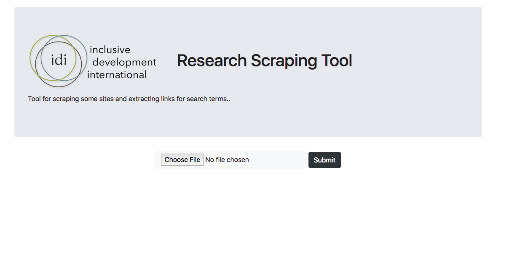
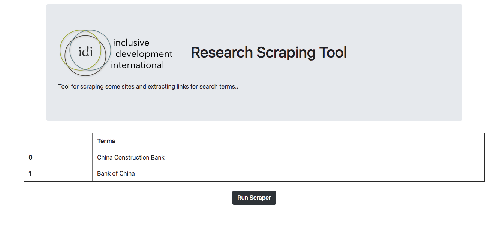
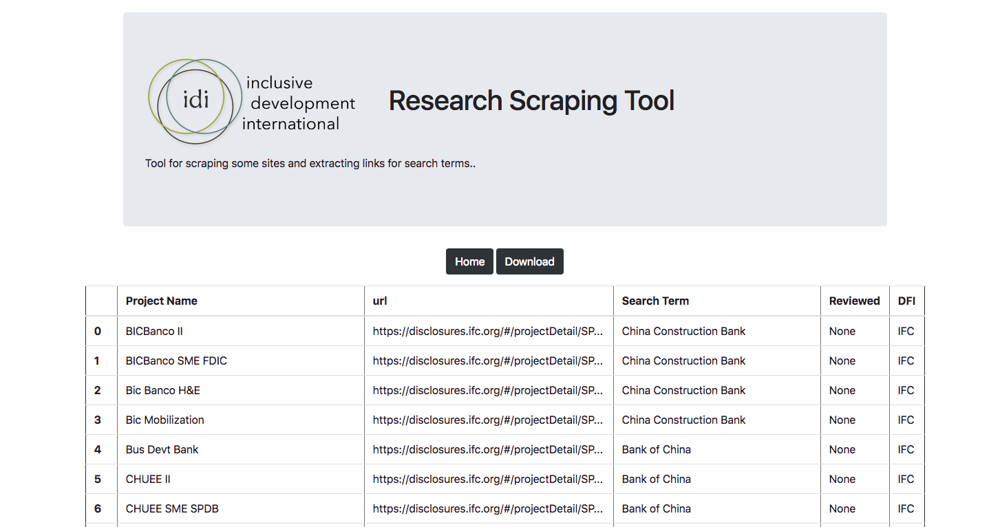

# idi-datadive-scoping

IDI scoping repo - see  [Project Brief](https://docs.google.com/document/d/1sGneio4rzMvcZA9WSEO908Mce53GeSwuOvBeaRbV0rA/edit#heading=h.hs0b4pt5bzef) for more detailed information on background, goals, etc.

## Proposed Methodology
At the DataDive - data scientists will work to develop a simple scraper tool that take as an input “search terms” and provide the links to projects that resulted when those terms were searched.
This tool will be comprised of numerous subtools that search specific DFI websites. At the DataDive we will prioritize the creation of scrapers based on IDI’s prioritization. Scrapers will be written in Python likely using some combination of Selenium, Beautifulsoup, requests, etc.

## General Requirements
* Tool(s) take a csv/excel list of search terms as input
* Tool(s) return a csv/excel file with a list of links that were found for a specific search term, each row should include (where available)
* Project Name
* Search Term Used
* DFI Site scrape extracted from (what bank is being scraped)
* Tool(s) are easy to execute and have straightforward instructions for use.
* Tool(s) cover high priority DFI sites
* All scrapers return data in an identical format - meaning the output has the same columns and meanings as all other scrapers. If some data is only available for a subset of DFIs then that column will be present but empty for the DFIs that do not have that information.
* Tool(s) deduplicate projects by specific DFI site, tool should not deduplicate across DFI sites.

## Getting Started

### Prerequisites

* Python 3 (https://www.python.org/downloads/)
* Optional, but recommended: Virtualenv (https://virtualenv.pypa.io/en/stable/) / virtualenvwrapper (https://virtualenvwrapper.readthedocs.io/en/latest/)

### To start contributing to one of the scrapers

Most people will follow this route.

1. Clone the repository (Click "Clone or download"; click the copy button; `git clone {copied text}`)
2. Setup a [virtual environment](https://python-guide-cn.readthedocs.io/en/latest/dev/virtualenvs.html) (optional, but recommended): `mkvirtualenv idi-datadive-2018`
3. Navigate to `./scrapers`
4. `pip install -r requirements.txt` to install the requirements
5. If you decide you need Selenium, you may need to install ChromeDriver. Call out in Slack if you need help.
6. Sign up for a scraper to work on, then use the following files in `scrapers` to get started on your own:
    * `miga_scraper.py` - blank template
    * `worldbank_scraper.py` - example of using requests and a data API
    * `ifc_scraper.py` - example of using Selenium and Beautiful Soup
7. Once you're ready to test your work, update `test_scraper.py` to point to your new work. Then run `python test_scraper.py`
8. Examine the outputs and the file, `test.csv`
9. If everything looks good, submit it for checking and merging. Congrats! Share any tips or tricks you used with the others on Slack.

### To test the full app

This route is for anyone who wants to contribute to the Flask app, directly.
The demo Flask app & scrapers are found in `/flask_scraper_demo`.

1. Clone the repository (Click "Clone or download"; click the copy button; `git clone {copied text}`)
2. Setup a [virtual environment](https://python-guide-cn.readthedocs.io/en/latest/dev/virtualenvs.html) (optional, but recommended): `mkvirtualenv idi-datadive-2018`
3. Navigate to `./flask_scraper_demo`
4. `make setup` to install the requirements
5. `make run` to run the app
5. You may need to install ChromeDriver. Call out in Slack if you need help.
6. Navigate to http://localhost:5000/ to make sure the app works
7. On the app, choose the `Search_Terms.txt` file & click "Submit"
8. It should show 2 search terms: click "Run Scraper"
9. Make sure the status of the scrapers is printed to your terminal
10. Make sure the table displays on the web page at the end of the run
11. The main files of interest are:
    * [`app/routes.py`](https://github.com/datakind/idi-datadive-2018/blob/master/flask_scraper_demo/app/routes.py) - This file defines the routes and does some of the data munging.
    * [`app/helpers.py`](https://github.com/datakind/idi-datadive-2018/blob/master/flask_scraper_demo/app/helpers.py) - This file has a TableBuilder class to help with displaying and exporting results.
    * [`app/scrapers/execute_search.py`](https://github.com/datakind/idi-datadive-2018/blob/master/flask_scraper_demo/app/scrapers/execute_search.py) - This file is responsible for calling all of the contributed scrapers and gathering results.

This *proof of concept* app takes as input a csv file of search terms and searches the [IFC](https://disclosures.ifc.org/#/enterpriseSearchResultsHome/*) site. It only works for this site currently. If you want to run it there is a demo search terms file located at `flask_scraper_demo/Search_Terms.txt`.

**Running in Docker**
Run the flask app in docker

1. Download Docker
    * [Mac Download](https://download.docker.com/mac/stable/Docker.dmg)
    * [Windows Download](https://download.docker.com/win/stable/Docker%20for%20Windows%20Installer.exe)
    * [Other systems](https://www.docker.com/community-edition#/download) *(may need to create an account to get download links)*
2. Follow the installation instructions ([Docker Install Docs](https://docs.docker.com/install/))
3. Open Docker (double-click the icon after it's installed)
4. Open your Terminal
5. Run the app (container): `docker run -d -p 5000:5000 jimjshields/idi:latest`
    * To get updates, first run `docker pull jimjshields/idi:latest`
    * To stop the service, get the *CONTAINER ID* by running: `docker ps`. Then stop it with `docker kill the_id`
6. Navigate to http://localhost:5000/

**Making changes to the code**
Pre-req: You have a Docker account, and Docker is installed and running (see above)

1. If possible, merge the changes to the `master` branch of this repository (so we have them saved for the future)
2. Build the docker container: `docker build -t {username}/idi:latest .`
3. Try running the container to make sure it works: `docker run -it -p 5000:5000 {username}/idi:latest` *(use `-it` here to be able to see the output of the flask app to debug)*
4. Navigate to http://localhost:5000/ and make sure your changes are incorporated!
5. Once you confirm that it works, push the container to you account: `docker push {username}/idi:latest`
    * This will be uploaded to a docker hub account - similar to GitHub - so you will not need to build on every computer

**Landing Page**

__________________________

**Load Search Terms**

__________________________
**Results Page**

